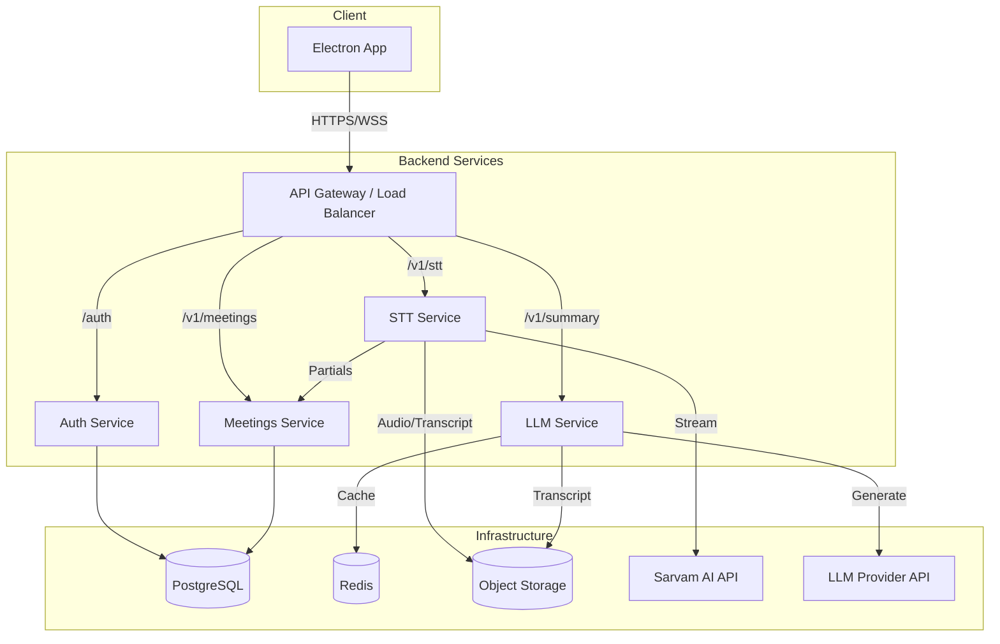
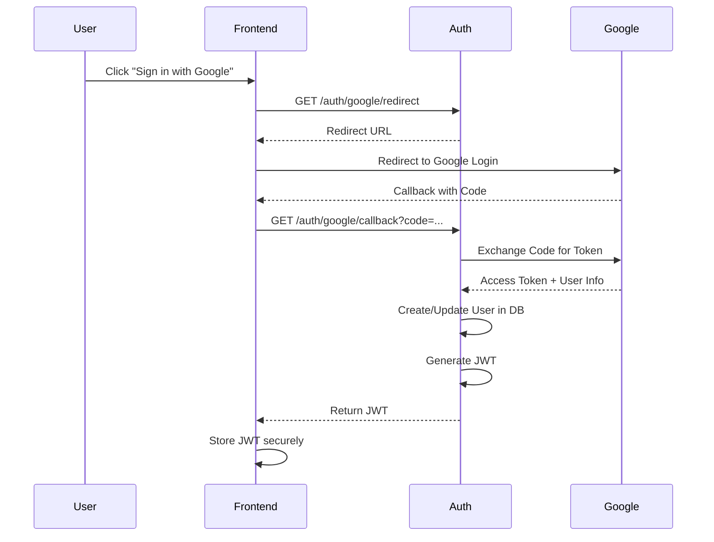
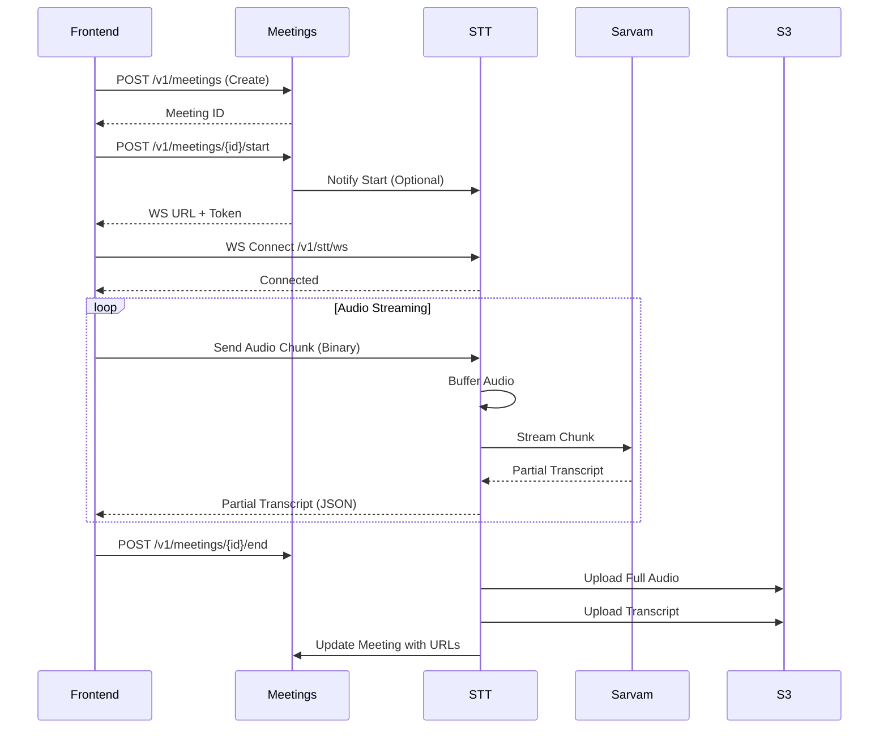
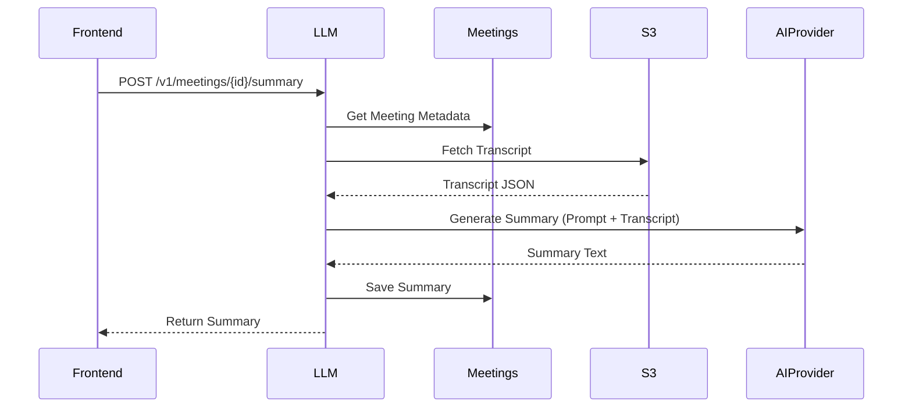
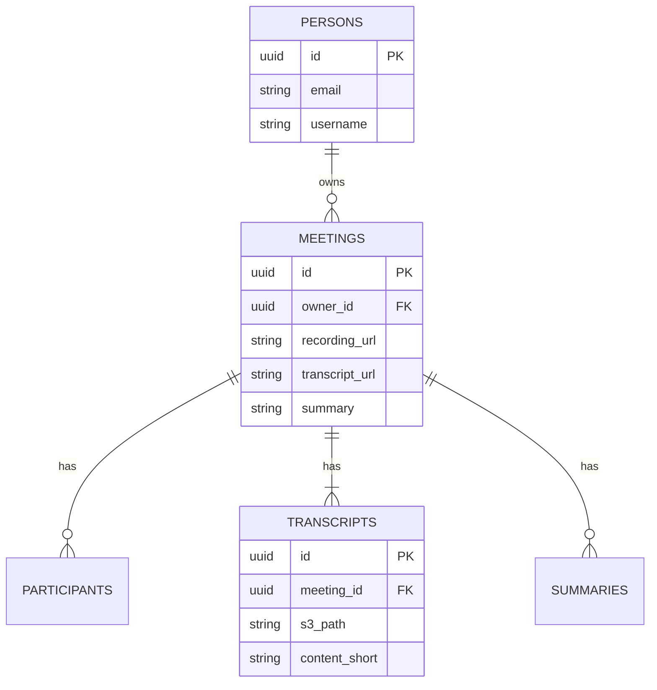

# NoteLytix Architecture Documentation

## High-Level Design (HLD)

### System Overview
NoteLytix is a meeting recording and transcription system composed of a desktop frontend and a set of backend microservices.

### Key Components
1.  **Electron App**: Captures audio, handles UI, streams audio to backend.
2.  **Auth Service**: Manages Google OAuth2 and user sessions.
3.  **STT Service**: Handles real-time audio streaming, communicates with Sarvam AI, and manages file uploads to S3.
4.  **Meetings Service**: Manages meeting metadata, participants, and transcript storage references.
5.  **LLM Service**: Generates summaries from transcripts using external LLM providers.

---

## Low-Level Design (LLD) & Workflows

### 1. Authentication Flow

### 2. Start Meeting & STT Flow

### 3. Summary Generation Flow

### Database Schema (ER Diagram)

